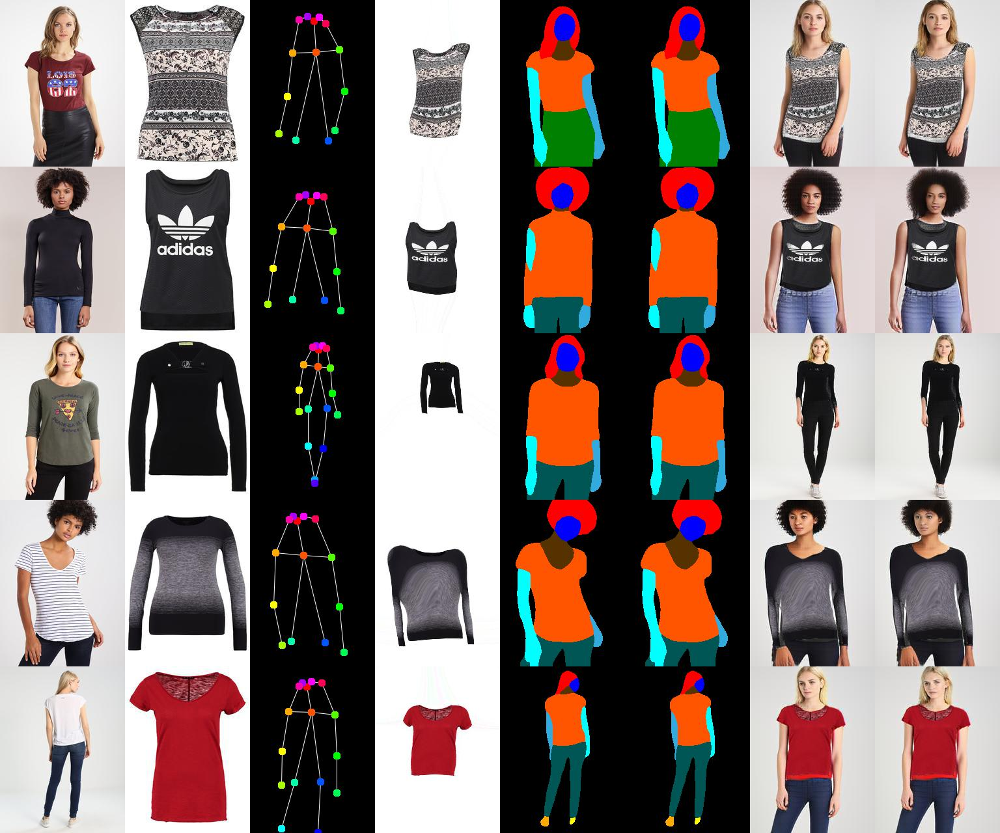

# Down to the Last Detail: Virtual Try-on with Detail Carving 

Code for virtual try-on with high-fidelity details. The code was developed and tested with Pytorch0.4.1. 



# Getting Started 
## Installation
* Clone this repo
```
git clone https://github.com/AIprogrammer/Detailed-virtual-try-on.git. 
cd Detailed-virtual-try-on
```
* Download our pretrained models from [Google Drive](https://drive.google.com/open?id=1vQo4xNGdYe2uAtur0mDlHY7W2ZR3shWT), and put them in "./pretrained_checkpoint". 

## Demo 
* We provide a demo model, as well as some samples in "./dataset/images". Triplets including source image, target pose, target cloth is provided in the "./demo/demo.txt".
* Quick testing and checking results in "./demo/forward/0.jpg" by running
```
sh demo.sh
```

# Training

## Download the dataset
* Download the MPV dataset from [Image-based Multi-pose Virtual Try On](http://47.100.21.47:9999/overview.php) and put the dataset under "./dataset/images/".
* Select postive perspective images, create dataset split file 'data_pair.txt', and put it under "./dataset/".

## Dataset preprocessing
* Pose keypoints. Use the [Openpose](https://github.com/CMU-Perceptual-Computing-Lab/openpose), and put the keypoints file in "./dataset/pose_coco".
* Semantic parsing. Use the [CIHP_PGN](https://github.com/Engineering-Course/CIHP_PGN), and put the parsing results in "./dataset/parse_cihp".
* Cloth mask. Use the "GrabCut" method for the cloth mask, and put the mask in "./dataset/cloth_mask".

## Coarse-to-fine training
* Download the VGG19 pretrained checkpoint
```
cd vgg_model/
wget https://download.pytorch.org/models/vgg19-dcbb9e9d.pth
```
* Set different configuration based on the "config.py". Then run
```
sh train.sh
```

## Related Publications
If you find this code helpful, please cite our paper:
```
@inproceedings{detail2019,
  title={Down to the Last Detail: Virtual Try-on with Detail Carving},
  author={Wang, Jiahang and Zhang, Wei and Liu, Weizhong and Mei, Tao},
  booktitle = {arXiv:1912.06324},
  year={2019}
}

@inproceedings{cvpr19,
  title={Unsupervised Person Image Generation with Semantic Parsing Transformation},
  author={Song, Sijie and Zhang, Wei and Liu, Jiaying and Mei, Tao},
  booktitle = {CVPR},
  year={2019}
}

@inproceedings{pami20,
  title={Unpaired Person Image Generation with Semantic Parsing Transformation},
  author={Song, Sijie and Zhang, Wei and Liu, Jiaying and Guo, Zongming and Mei, Tao},
  booktitle = {IEEE Trans. on PAMI},
  year={2020}
}

```
